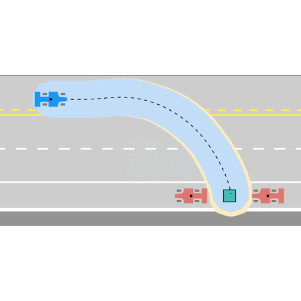
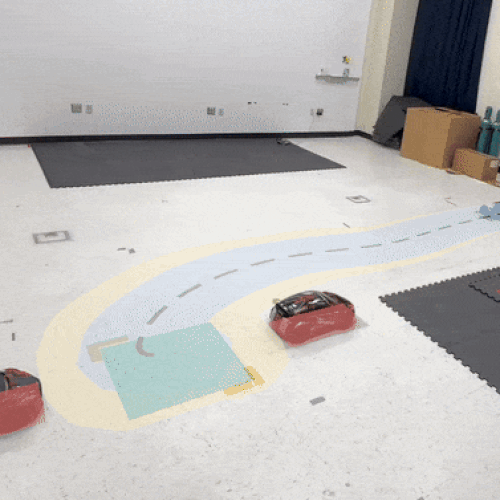

# Neural /Piecewise Affine Reach-avoid Computation (NeuralPARC)

NeuralPARC (ICRA'25) is an extension of [PARC](https://github.com/safe-robotics-lab-gt/PARC/) (RSS'24), which computes a set of initial positions and trajectory parameters with which a robot is *guaranteed* to reach a goal through *narrow gaps*. It improves upon the original method in three ways:
1. No assumption on system dynamics (*black-box*);
2. No need for a *nominal plan*;
3. Can arbitrarily decrease modelling error by adding more neurons.

Since NeuralPARC is data-driven, it is agnostic to how the black-box trajectories are generated as long as they are well-behaved and modellable, enabling it to provide safety guarantees on top of extreme maneuvers (e.g. `drifting`) or even learning-based policies (e.g. `boatsim`).

<p align="center">
    
    
    
</p>

------- 
[**[Website]**](https://saferoboticslab.me.gatech.edu/research/neuralparc/) &ensp; [**[Paper]**](https://arxiv.org/abs/2409.13195) &ensp; [**[Video]**](https://www.youtube.com/watch?v=2-PIZtI05Ys)

-------
**Authors:** Long Kiu Chung, Wonsuhk Jung, Srivatsank Pullabhotla, Parth Shinde, Yadu Sunil, Saihari Kota, Luis Felipe Wolf Batista, Cédric Pradalier, and Shreyas Kousik.

-------
## Updates
- [2024/10/02] **v0.1.0**: Initial code release
- [2025/03/03] **v0.1.1**: Updated citations

-------
## Setup Requirements
### Installation
To run this code, you will need
1. [MPT3 Toolbox](https://www.mpt3.org/)
2. [simulator](https://github.com/skousik/simulator)

-------
## Navigating This Repo
### Example Systems
1. Declare `init_drifting` or `init_boatsim` within the files in `main` to see NeuralPARC in action.
2. For `drifting`, we provide scripts for rolling out trajectories, validation, and visualization.
3. For `boatsim`, trajectories are collected and validated in [Isaac Sim](https://github.com/luisfelipewb/RL4WasteCapture/). We provide a subset of the collected trajectories in `boatsim_rawdata.mat` so the rest of the pipeline could be run on this repo.

### Custom System
To run NeuralPARC on a custom dynamical system, simply provide `_rawdata.mat` and `init` files with the same structure as the provided examples. Then run the files in `main` to apply NeuralPARC.

-------
## Citation
Please cite [this paper](https://arxiv.org/abs/2409.13195) if you use `NeuralPARC`:
```bibtex
@article{chung2025guaranteed,
  title={Guaranteed Reach-Avoid for Black-Box Systems through Narrow Gaps via Neural Network Reachability},
  author={Chung, Long Kiu and Jung, Wonsuhk and Pullabhotla, Srivatsank and Shinde, Parth and Sunil, Yadu and Kota, Saihari and Batista, Luis Felipe Wolf and Pradalier, C{\'e}dric and Kousik, Shreyas},
  booktitle={2025 IEEE International Conference on Robotics and Automation (ICRA)},
  year={2025},
  organization={IEEE}
}
```